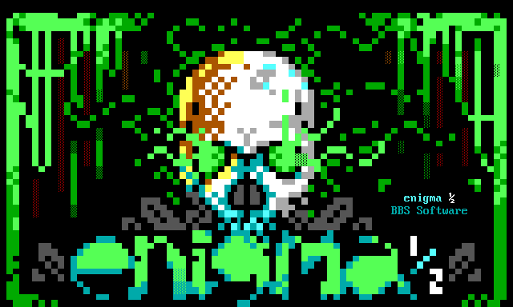

# ENiGMA½ BBS Software



ENiGMA½ is a modern BBS software with a nostalgic flair!

## Features Available Now
 * Multi platform: Anywhere [Node.js](https://nodejs.org/) runs likely works (known to work under Linux, FreeBSD, OpenBSD, OS X and Windows)
 * Unlimited multi node support (for all those BBS "callers"!)
 * **Highly** customizable via [HJSON](http://hjson.org/) based configuration, menus, and themes in addition to JavaScript based [mods](docs/modding/existing-mods.md)
 * [MCI support](docs/art/mci.md) for lightbars, toggles, input areas, and so on plus many other other bells and whistles
 * Telnet, **SSH**, and both secure and non-secure [WebSocket](https://en.wikipedia.org/wiki/WebSocket) access built in! Additional servers are easy to implement
 * [CP437](http://www.ascii-codes.com/) and UTF-8 output
 * [SyncTERM](http://syncterm.bbsdev.net/) style font and baud emulation support. Display PC/DOS and Amiga style artwork as it's intended! In general, ANSI-BBS / [cterm.txt](http://cvs.synchro.net/cgi-bin/viewcvs.cgi/*checkout*/src/conio/cterm.txt?content-type=text%2Fplain&revision=HEAD) / [bansi.txt](http://www.bbsdocumentary.com/library/PROGRAMS/GRAPHICS/ANSI/bansi.txt) are followed for expected BBS behavior.
 * Full [SAUCE](http://www.acid.org/info/sauce/sauce.htm) support.
 * Renegade style [pipe color codes](./docs/configuration/colour-codes.md).
 * [SQLite](http://sqlite.org/) storage of users, message areas, etc.
 * Strong [PBKDF2](https://en.wikipedia.org/wiki/PBKDF2) backed password encryption.
 * Support for 2-Factor Authentication with One-Time-Passwords
 * [Door support](docs/modding/door-servers.md) including common dropfile formats for legacy DOS doors. Built in [BBSLink](http://bbslink.net/), [DoorParty](http://forums.throwbackbbs.com/), [Exodus](https://oddnetwork.org/exodus/) and [CombatNet](http://combatnet.us/) support!
 * [Bunyan](https://github.com/trentm/node-bunyan) logging!
 * [Message networks](docs/messageareas/message-networks.md) with FidoNet Type Network (FTN) + BinkleyTerm Style Outbound (BSO) message import/export. Messages Bases can also be exposed via [Gopher](docs/servers/gopher.md), or [NNTP](docs/servers/nntp.md)!
 * [Gazelle](https://github.com/WhatCD/Gazelle) inspired File Bases including fast fully indexed full text search (FTS), #tags, and HTTP(S) temporary download URLs using a built in [web server](docs/servers/web-server.md). Legacy X/Y/Z modem also supported!
 * Upload processor supporting [FILE_ID.DIZ](https://en.wikipedia.org/wiki/FILE_ID.DIZ) and [NFO](https://en.wikipedia.org/wiki/.nfo) extraction, year estimation, and more!
 * ANSI support in the Full Screen Editor (FSE), file descriptions, etc.
 * A built in achievement system. BBSing gamified!

 ...and much much more. Please check out [the issue tracker](https://github.com/NuSkooler/enigma-bbs/issues) and feel free to request features (or contribute!) features!

## Documentation
[Browse the docs online](https://nuskooler.github.io/enigma-bbs/). Be sure to checkout the [/docs/](./docs/) folder as well for the latest and greatest documentation.

## Installation
On most *nix systems simply run the following from your terminal:
```
curl -o- https://raw.githubusercontent.com/NuSkooler/enigma-bbs/master/misc/install.sh | bash
```

Please see [Installation Methods](https://nuskooler.github.io/enigma-bbs/installation/installation-methods.html) for Windows, Docker, and so on...

## Donating
If you feel the urge to donate, [you can do so here](https://liberapay.com/NuSkooler/donate)<br/>

<a href="https://liberapay.com/NuSkooler/donate"></a>

## Support
* See [Discussions](https://github.com/NuSkooler/enigma-bbs/discussions) and [the issue tracker](https://github.com/NuSkooler/enigma-bbs/issues)
* **Discussion on a ENiGMA BBS!** (see Boards below)
* IRC: **#enigma-bbs** on **irc.libera.chat:6697(TLS)** ([webchat](https://web.libera.chat/gamja/?channels=#enigma-bbs))
* FSX_ENG on [fsxNet](http://bbs.geek.nz/#fsxNet) or ARK_ENIG on [ArakNet](https://www.araknet.xyz/) available on many fine boards
* Email: bryan -at- l33t.codes
* [Facebook ENiGMA½ group](https://www.facebook.com/groups/enigmabbs/)

## Terminal Clients
ENiGMA has been tested with many terminals. However, the following are suggested for BBSing:
* [VTX](https://github.com/codewar65/VTX_ClientServer) (Try [Xibalba using VTX](https://l33t.codes/vtx/xibalba.html)!)
* [SyncTERM](http://syncterm.bbsdev.net/)
* [EtherTerm](https://github.com/M-griffin/EtherTerm)
* [NetRunner](http://mysticbbs.com/downloads.html)
* [MagiTerm](https://magickabbs.com/index.php/magiterm/)

## Some Boards
* :skull: [Xibalba - ENiGMA WHQ](https://l33t.codes/xibalba-bbs) :skull: (**ssh://xibalba.l33t.codes:44511** or **telnet://xibalba.l33t.codes:44510**)
* [fORCE9](http://bbs.force9.org/): (**telnet://bbs.force9.org**)
* [Undercurrents](https://undercurrents.io): (**ssh://undercurrents.io**)
* [PlaneT Afr0](https://planetafr0.org/): (**ssh://planetafr0.org:8889**)

## Special Thanks
(in no particular order)
* [Dave Stephens aka RiPuk](https://github.com/davestephens) for the awesome [ENiGMA website](https://enigma-bbs.github.io/) and [KICK ASS documentation](https://nuskooler.github.io/enigma-bbs/), code contributions, etc.
* [Daniel Mecklenburg Jr.](https://github.com/codewar65) for the awesome VTX terminal and general coding talk
* [M. Brutman](http://www.brutman.com/), author of [mTCP](http://www.brutman.com/mTCP/mTCP.html) (Interwebs for DOS!)
* [M. Griffin](https://github.com/M-griffin), author of [Enthral BBS](https://github.com/M-griffin/Enthral), [Oblivion/2 XRM](https://github.com/M-griffin/Oblivion2-XRM) and [EtherTerm](https://github.com/M-griffin/EtherTerm)!
* [Caphood](http://www.reddit.com/user/Caphood), supreme SysOp of [BLACK ƒlag](http://www.bbsnexus.com/directory/listing/blackflag.html) BBS
* [Luciano Ayres](http://www.lucianoayres.com.br/) of [Blocktronics](http://blocktronics.org/), creator of the "Mystery Skulls" default ENiGMA½ theme!
* Sudndeath for Xibalba ANSI work!
* Jack Phlash for kick ass ENiGMA½ and Xibalba ASCII (Check out [IMPURE60](http://pc.textmod.es/pack/impure60/)!!)
* Avon of [Agency BBS](http://bbs.geek.nz/) and [fsxNet](http://bbs.geek.nz/#fsxNet) for putting up with my experiments to his system and for FSX_ENG!
* Maskreet of [Throwback BBS](http://www.throwbackbbs.com/) hosting [DoorParty](http://forums.throwbackbbs.com/)!
* [Apam](https://github.com/apamment) of [Magicka](https://magickabbs.com/)
* [nail/blocktronics](http://blocktronics.org/tag/nail/) for the [sickmade Xibalba logo](http://pc.textmod.es/pack/blocktronics-420/n-xbalba.ans)!
* [Whazzit/blocktronics](http://blocktronics.org/tag/whazzit/) for the amazing Mayan ANSI pieces scattered about Xibalba BBS!
* [Smooth](https://16colo.rs/tags/artist/smooth)/[fUEL](https://fuel.wtf/) for lots of dope art. Why not [snag a T-Shirt](https://www.redbubble.com/people/araknet/works/39126831-enigma-1-2-software-logo-design-by-smooth-of-fuel?p=t-shirt)?
* Al's Geek Lab for the [installation video](https://youtu.be/WnN-ucVi3ZU) and of course the [Back to the BBS - Part one: The return to being online](https://www.youtube.com/watch?reload=9&v=n0OwGSX2IiQ) documentary!
* Alpha for the [FTN-style configuration guide](https://medium.com/@alpha_11845/setting-up-ftn-style-message-networks-with-enigma%C2%BD-bbs-709b22a1ae0d)!
* Huge shout out to [cognitivegears ](https://github.com/cognitivegears) for the various fixes, improvements, and **removing the need for cursor position reports** providing a much better terminal experience!

...and so many others! This project would be nothing without the BBS and artscene communities!

## License
Released under the [BSD 2-clause](https://opensource.org/licenses/BSD-2-Clause) license:

Copyright (c) 2015-2022, Bryan D. Ashby
All rights reserved.

Redistribution and use in source and binary forms, with or without
modification, are permitted provided that the following conditions are met:

* Redistributions of source code must retain the above copyright notice, this
  list of conditions and the following disclaimer.

* Redistributions in binary form must reproduce the above copyright notice,
  this list of conditions and the following disclaimer in the documentation
  and/or other materials provided with the distribution.

THIS SOFTWARE IS PROVIDED BY THE COPYRIGHT HOLDERS AND CONTRIBUTORS "AS IS"
AND ANY EXPRESS OR IMPLIED WARRANTIES, INCLUDING, BUT NOT LIMITED TO, THE
IMPLIED WARRANTIES OF MERCHANTABILITY AND FITNESS FOR A PARTICULAR PURPOSE ARE
DISCLAIMED. IN NO EVENT SHALL THE COPYRIGHT HOLDER OR CONTRIBUTORS BE LIABLE
FOR ANY DIRECT, INDIRECT, INCIDENTAL, SPECIAL, EXEMPLARY, OR CONSEQUENTIAL
DAMAGES (INCLUDING, BUT NOT LIMITED TO, PROCUREMENT OF SUBSTITUTE GOODS OR
SERVICES; LOSS OF USE, DATA, OR PROFITS; OR BUSINESS INTERRUPTION) HOWEVER
CAUSED AND ON ANY THEORY OF LIABILITY, WHETHER IN CONTRACT, STRICT LIABILITY,
OR TORT (INCLUDING NEGLIGENCE OR OTHERWISE) ARISING IN ANY WAY OUT OF THE USE
OF THIS SOFTWARE, EVEN IF ADVISED OF THE POSSIBILITY OF SUCH DAMAGE.
