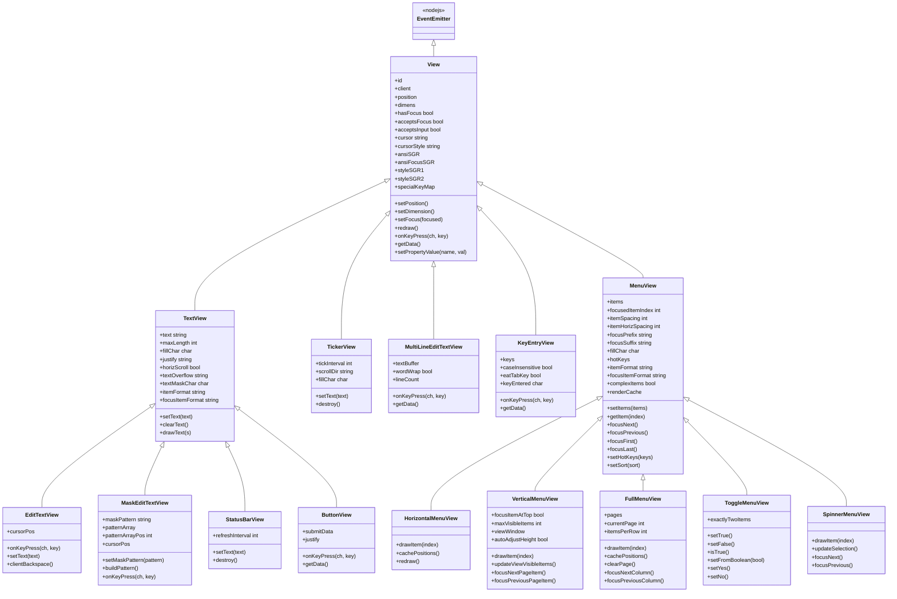

## Views

Views are the interactive and display widgets that make up ENiGMA½ screens. They are placed in art files using [MCI codes](../mci.md) and configured via `menu.hjson` and `theme.hjson`. Every element a user sees or interacts with — a text label, an input field, a menu list — is a view.

## General Information

> :information_source: Views are instantiated by placing an MCI code in an art file. The code determines the view type; an optional number suffix ties it to a specific view ID. For example: `%VM1` creates a Vertical Menu View with ID 1.

> :information_source: Standard and focus colors are set by placing duplicate MCI codes back-to-back in the art file. The first occurrence sets the normal color, the second sets the focused color.

> :information_source: See [MCI](../mci.md) for general information on MCI codes and the common configuration properties shared by all views.

### Common Properties

The following properties are available on all views:

| Property | Description |
|----------|-------------|
| `focus` | If set to `true`, this view receives initial focus when the screen loads |
| `submit` | If set to `true`, an `accept` action on this view will submit the enclosing form |
| `argName` | The key name used to identify this view's value in a submitted form |
| `width` | Width of the view in columns |
| `height` | Height of the view in rows (where applicable) |
| `textStyle` | Standard (non-focus) text style. See **Text Styles** in [MCI](../mci.md) |
| `focusTextStyle` | Text style when the view has focus. See **Text Styles** in [MCI](../mci.md) |

---

## View Types

### Display Views

| View | MCI Code | Description |
|------|----------|-------------|
| [Text View](text_view.md) | `%TL` | A static single-line text label |
| [Ticker View](ticker_view.md) | `%TK` | A continuously scrolling marquee |
| [Status Bar View](status_bar_view.md) | `%SB` | An auto-refreshing text label |

### Input Views

| View | MCI Code | Description |
|------|----------|-------------|
| [Edit Text View](edit_text_view.md) | `%ET` | A single-line text input field |
| [Mask Edit Text View](mask_edit_text_view.md) | `%ME` | A single-line input field constrained by a pattern (e.g. dates, phone numbers) |
| [Multi Line Edit Text View](multi_line_edit_text_view.md) | `%MT` | A full multi-line text editor |
| [Button View](button_view.md) | `%BN` | A labeled button that triggers an action when activated |

### Selection / Menu Views

| View | MCI Code | Description |
|------|----------|-------------|
| [Horizontal Menu View](horizontal_menu_view.md) | `%HM` | A single-row horizontal list of selectable items |
| [Vertical Menu View](vertical_menu_view.md) | `%VM` | A scrolling vertical list, similar to a lightbar menu |
| [Full Menu View](full_menu_view.md) | `%FM` | A paginated multi-column grid of selectable items |
| [Toggle Menu View](toggle_menu_view.md) | `%TM` | A two-item toggle, typically used for Yes/No or On/Off choices |
| [Spinner Menu View](spinner_menu_view.md) | `%SM` | A single-item rotary selector that cycles through a list |

---

## Class Hierarchy

The following diagram shows the inheritance relationships between all view types. All views ultimately extend Node.js's `EventEmitter` through the base `View` class.

---

## How Views Fit Together

Views are placed on screen via MCI codes in an art file. They are grouped into **forms** — a form collects input from one or more views and submits the result as a set of named key/value pairs (each view's `argName` maps to its `getData()` result).

The general flow is:

1. An art file is loaded and MCI codes are scanned to instantiate views
2. Views are configured from `menu.hjson` (per-entry `config`) and `theme.hjson` (styling)
3. Focus cycles through views that have `acceptsFocus: true`, driven by Tab / arrow keys
4. When a view with `submit: true` receives an `accept` action, the form is submitted
5. The submitted form data drives the next menu action or module behaviour

> :information_source: See [MCI](../mci.md) for details on formatting, text styles, and how MCI codes relate to menus and themes.
