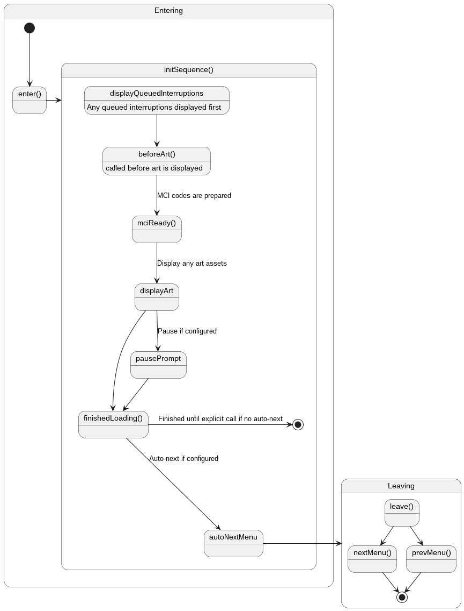

## Menu Modules
From initial connection to the screens and mods your users interact with, the entire experience is made up of menu entries — And all menu entries found within [menu.hjson](../configuration/menu-hjson.md) are backed by *Menu Modules*. For basic menus, a standard handler is implemented requiring no code. However, if you would like to create a menu that has custom handling, you will very likely be inheriting from from `MenuModule`. More on this below.

> :information_source: Remember that ENiGMA does not impose any stucture to your system! The "flow" of all `menu.hjson` entries is up to you!

> :bulb: If the `module` entry is not present in a `menu.hjson` entry, the system automatically uses [standard_menu.js](/core/standard_menu.js).

## Creating a New Module
At the highest level, to create a new custom menu or mod, inherit from `MenuModule` and expose it via the `getModule` exported method:

```javascript
// my_fancy_module.js
exports.getModule = class MyFancyModule extends MenuModule {
  constructor(options) {
    super(options);
  }
};
```

Next, override the appropriate methods to add some functionality! Below is an example fragment overriding just `initSequence()`:

```javascript
initSequence() {
    async.series(
        [
            callback => {
                // call base method
                return this.beforeArt(callback);
            },
            callback => {
                // a private method to display a main "page"
                return this._displayMainPage(false, callback);
            },
        ],
        () => {
            this.finishedLoading();
        }
    );
}
```

> :bulb: Remember that *all* menus within ENiGMA are created by inheriting from `MenuModule`. Take a look at existing examples such as [WFC](/core/wfc.js), [NUA](/core/nua.js), [MRC](/core/mrc.js) and more!

### ModuleInfo
To register your module with the system, include a `ModuleInfo` declaration in your exports. The following members are available:

| Field | Required | Description |
|-------|----------|-------------|
| `name` | :+1: | Short name of the module |
| `desc` | :+1: | Long description of this module |
| `author` | :+1: | Author(s) of module |
| `packageName` | :-1: | Defines a reverse DNS style package name. Can be used in conjunction with the `getModDatabasePath()` call form [database.js](/core/database.js) to interact with a database specific to your module (See example below) |

**Example**:

```javascript
exports.ModuleInfo = {
  name: 'Super Dope Mod',
  desc: '...a super dope mod, duh.',
  author: 'You!',
  packageName: `com.myname.foo.super-dope-mod`,
};
```

### Per-Mod Databases
Custom mods often need their own data persistence. This can be acheived with `getModDatabsePath()` and your `ModuleInfo`'s `packageName`.

**Example**:
```javascript
self.database = getTransactionDatabase(
    new sqlite3.Database(getModDatabasePath(moduleInfo), callback)
);
```

Given the `packageName` above, a database will be created at the following location:
```bash
$enigma-bbs/db/mods/com.myname.foo.super-dope-mod.sqlite3
```

### Menu Methods
Form handler methods specified by `@method:someName` in your `menu.hjson` entries map to those found in your module's `menuMethods` object. That is, `this.menuMethods` and have the following signature `(formData, extraArgs, cb)`. For example, consider the following `menu.hjson` fragment:

```hjson
actionKeys: [
  {
    keys: [ "a", "shift + a" ]
    action: @method:toggleAvailable
  }
]
```

We can handle this in our module as such:
```javascript
exports.getModule = class MyFancyModule extends MenuModule {
  constructor(options) {
    super(options);

    this.menuMethods = {
      toggleAvailable: (formData, extraArgs, cb) => {
        // ...do something fancy...
        return cb(null);
      }
    };
  }
}
```

## MenuModule Lifecycle
Below is a very high level diagram showing the basic lifecycle of a MenuModule.



Methods indicated above with `()` in their name such as `enter()` are overridable when inheriting form `MenuModule`.

## MenuModule Helper Methods
Many helper methods exist and are available to code inheriting from `MenuModule`. Below are some examples. Poke around at [menu_module.js](../../../core/menu_module.js) to discover more!

### Views & View Controller
#### `displayAsset(name | Buffer, options, callback)`:
Display an asset by `name` or by supplying an `Buffer`.
`options` is an optional Object with any of the following properties:
* `clearScreen` (Boolean): Should the screen be cleared first?
* `encoding` (String): Encoding of `Buffer` if used. Defaults to `cp437`.
* `font` (String): SyncTERM style font to use.
* `trailingLF` (Boolean): Should a trailing LF be allowed?
* `startRow` (Number): Row in which to start drawing at

#### `prepViewController(name, formId, mciMap, callback)`:
Prepares the menu's View Controller for a form of `name` and `formId` using the supplied `mciMap`. `callback` has the following siguature: `(err, viewController, created)` where `created` is `true` if a new View Controller was made.


* `prepViewControllerWithArt()`
* `displayArtAndPrepViewController()`
* `setViewText()`
* `getView()`
* `updateCustomViewTextsWithFilter()`
* `refreshPredefinedMciViewsByCode()`

### Validation
* `validateMCIByViewIds()`
* `validateConfigFields()`

### Date/Time Helpers
The following methods take a single input to specify style, defaulting to `short`. If your menu or theme `config` block specifies a cooresponding value such as `dateFormat` or `dateTimeFormat`, that value will be used, else standard fallbacks apply:
* `getDateFormat()`
* `getTimeFormat()`
* `getDateTimeFormat()`

### Misc
* `promptForInput()`


`standardMCIReadyHandler()`: This is a standard and commonly used `mciReady()` implementation:

```javascript
mciReady(mciData, cb) {
  return this.standardMCIReadyHandler(mciData, cb);
}
```

Where `mciData` is a Object mapping [MCI codes](../art/mci.md) such as `TL2` to their properties:
* `SGR`: Graphics rendition
* `focusSGR` (Only present if art contained both, ie: `TL2^[0;mTL2`)
* `position` (Array of Number): Position in [Row, Column] order
* `args` (Array): Any arguments to the MCI code
* `code` (String): The code itself, such as `TL`
* `id` (Number): The MCI code's ID such as `1`

> :information_source: Search the code for the above methods to see how they are used in the base system!


## Custom Mods
Most mods will also derive from `MenuModule`. Some things to be aware of:
* Custom mods that bring in their own dependencies must also include their own `package.json` and other Node requirements
* Be sure to use `packageName` and `getModDatabasePath()` for any peristence needs.
