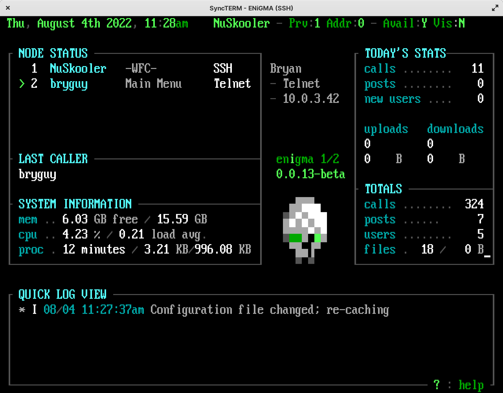

## The Waiting For Caller (WFC) Module
The `wfc.js` module provides a Waiting For Caller (WFC) type dashboard from a bygone era. Many traditional features are available including newer concepts for modern times. Node spy is left out as it feels like something that should be left in the past.

<br/>

## Accessing the WFC
By default, the WFC may be accessed via the `!WFC` main menu command when connected over a secure connection via a user with the proper [ACS](../configuration/acs.md). This can be configured as per any other menu in the system. Note that ENiGMA½ does not expose the WFC as a standalone application as this would be much less flexible. To connect locally, simply use your favorite terminal or for example: `ssh -l yourname localhost 8889`. See **Security** below for more information.

## Security
The system allows any user with the proper security to access the WFC / system operator functionality. The security policy is enforced by ACS with the default of `SCAF2ID1GM[wfc]`, meaning the following are true:

1. Securely Connected (such as SSH or Secure WebSocket, but not Telnet)
2. [Auth Factor 2+](modding/user-2fa-otp-config.md). That is, the user has 2FA enabled.
3. User ID of 1 (root/admin)
4. The user belongs to the `wfc` group.

> :information_source: Due to the above, the WFC screen is **disabled** by default as at a minimum, you'll need to add your user to the `wfc` group. See also [Security](../configuration/security.md) for more information on keeping your system secure!

Adding your user to the `wfc` group:
```bash
# Repalce USERNAME with your leet +op username
./oputil.js user group USERNAME "+wfc"
```

To change the ACS required, specify a alternative `acs` in the `config` block. For example:
```hjson
mainMenuWaitingForCaller: {
    config: {
        // initial +op over secure connection only
        acs: ID1SC
    }
}
```

> :bulb: You can add additional co-ops by adjusting the required ACS and/or adding them to an WFC-able group.

> :lock: ENiGMA½ will enforce ACS of at least `SC` (secure connection)

## Theming
The following MCI codes are available:
* `VM1`: Node status list with the following format items available:
    * `text`: Username or `*Pre Auth*`.
    * `action`: Current action/menu.
    * `affils`: Any affiliations related to the if `authenticated`, else "N/A".
    * `authenticated`: Boolean rather the node is authenticated (logged in) or not.
    * `availIndicator`: Indicator of availability (e.g. for messaging)? Displayed via `statusAvailableIndicators` or system theme. See also [Themes](../art/themes.md).
    * `isAvailalbe`: Boolean rather the node is availalbe (e.g. for messaging) or not.
    * `isSecure`: Is the node securely connected (ie: SSL)?
    * `isVisible`: Boolean rather the node is visible to others or not.
    * `node`: The node ID.
    * `realName`: Real name of authenticated user, or "N/A".
    * `serverName`: Name of connected server such as "Telnet" or "SSH".
    * `timeOn`: How long the node has been connected.
    * `timeOnMinutes`: How long in **minutes** the node has been connected.
    * `userId`: User ID of authenticated node, or 0 if not yet authenticated.
    * `userName`: User name of authenticated user or "*Pre Auth*"
    * `visIndicator`: Indicator of visibility. Displayed via `statusVisibleIndicators` or system theme. See also [Themes](../art/themes.md).
    * `remoteAddress`: A friendly formatted remote address such as a IPv4 or IPv6 address.
* `VM2`: Quick log with the following format keys available:
    * `timestamp`: Log entry timestamp in `quickLogTimestampFormat` format.
    * `level`: Log entry level from Bunyan.
    * `levelIndicator`: Level indicators can be overridden with the `quickLogLevelIndicators` key (see defaults below)
    * `quickLogLevelIndicators`: A **map** defaulting to the following`:
        * `trace` : `T`
        * `debug`: `D`
        * `info`: `I`
        * `warn`: `W`
        * `error`: `E`
        * `fatal`: `F`
    * `nodeId`: Node ID.
    * `sessionId`: Session ID.
    * `quickLogLevelMessagePrefixes`: A **map** of log level names (see above) to message prefixes. Commonly used for changing message color with pipe codes, such as `|04` for red errors.
    * `message`: Log message.
* MCI 10...99: Custom entries with the following format keys available:
    * `nowDate`: Current date in the `dateFormat` style, defaulting to `short`.
    * `nowTime`: Current time in the `timeFormat` style, defaulting to `short`.
    * `now`: Current date and/or time in `nowDateTimeFormat` format.
    * `processUptimeSeconds`: Process (the BBS) uptime in seconds.
    * `totalCalls`: Total calls to the system.
    * `totalPosts`: Total posts to the system.
    * `totalUsers`: Total users on the system.
    * `totalFiles`: Total number of files on the system.
    * `totalFileBytes`: Total size in bytes of the file base.
    * `callsToday`: Number of calls today.
    * `postsToday`: Number of posts today.
    * `uploadsToday`: Number of uploads today.
    * `uploadBytesToday`: Total size in bytes of uploads today.
    * `downloadsToday`: Number of downloads today.
    * `downloadsBytesToday`: Total size in bytes of uploads today.
    * `newUsersToday`: Number of new users today.
    * `currentUserName`: Current user name.
    * `currentUserRealName`: Current user's real name.
    * `lastLoginUserName`: Last login username.
    * `lastLoginRealName`: Last login user's real name.
    * `lastLoginDate`: Last login date in `dateFormat` format.
    * `lastLoginTime`: Last login time in `timeFormat` format.
    * `lastLogin`: Last login date/time.
    * `totalMemoryBytes`: Total system memory in bytes.
    * `freeMemoryBytes`: Free system memory in bytes.
    * `systemAvgLoad`: System average load.
    * `systemCurrentLoad`: System current load.
    * `newPrivateMail`: Number of new **private** mail for current user.
    * `newMessagesAddrTo`: Number of new messages **addressed to the current user**.
    * `availIndicator`: Is the current user availalbe? Displayed via `statusAvailableIndicators` or system theme. See also [Themes](../art/themes.md).
    * `visIndicator`: Is the current user visible? Displayed via `statusVisibleIndicators` or system theme. See also [Themes](../art/themes.md).
    * `processBytesIngress`: Ingress bytes since ENiGMA started.
    * `processBytesEgress`: Egress bytes since ENiGMA started.


> :information_source: While [Standard MCI](../art/mci.md) codes work on any menu, they will **not** refresh. For values that may change over time, please use the custom format values above.