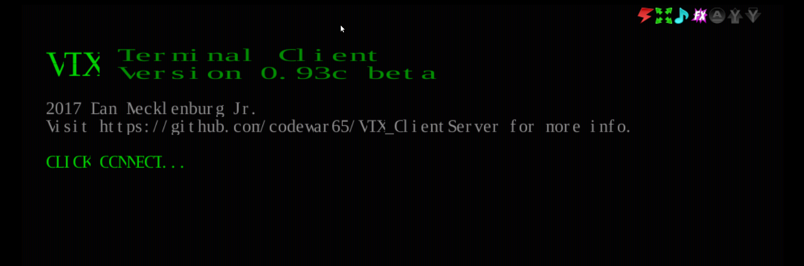

## WebSocket Login Server
The WebSocket Login Server provides **secure** (wss://) as well as non-secure (ws://) WebSocket login access. This is often combined with a browser based WebSocket client such as VTX or fTelnet.

# VTX Web Client
ENiGMA supports the VTX WebSocket client for connecting to your BBS from a web page. Example usage can be found at [Xibalba](https://xibalba.l33t.codes) and [fORCE9](https://bbs.force9.org/vtx/force9.html) amongst others.

## Before You Start
There are a few things out of scope of this document:

 - You'll need a web server for hosting the files - this can be anywhere, but it obviously makes sense to host it
 somewhere with a hostname relevant to your BBS!

 - It's not required, but you should use SSL certificates to secure your website, and for supplying to ENiGMA to
 secure the websocket connections. [Let's Encrypt](https://letsencrypt.org/) provide a free well-respected service.

 - How you make the websocket service available on the internet is up to you, but it'll likely by forwarding ports on
 your router to the box hosting ENiGMA. Use the same method you did for forwarding the telnet port.

## Setup

1. Enable the websocket in ENiGMA, by adding `webSocket` configuration to the `loginServers` block in `config.hjson` (create it if you
don't already have it defined).

````hjson
loginServers: {
        webSocket : {
                ws: {
                    // non-secure ws://
                    port: 8810
                    enabled: true

                    //  optional bind address
                    address: 127.0.0.1
                }
                wss: {
                    //  secure-over-tls wss://
                    port: 8811
                    enabled: true
                    certPem: /path/to/https_cert.pem
                    keyPem: /path/to/https_cert_key.pem
                }
                // set proxied to true to allow TLS-terminated proxied connections
                // containing the "X-Forwarded-Proto: https" header to be treated
                // as secure
                proxied: true
        }
}
````

2. Restart ENiGMA and check the logs to ensure the websocket service starts successfully, you'll see something like the
following:

    ````
    [2017-10-29T12:13:30.668Z]  INFO: ENiGMA½ BBS/30978 on force9: Listening for connections (server="WebSocket (insecure)", port=8810)
    [2017-10-29T12:13:30.669Z]  INFO: ENiGMA½ BBS/30978 on force9: Listening for connections (server="WebSocket (secure)", port=8811)
    ````

3. Download the [VTX_ClientServer](https://github.com/codewar65/VTX_ClientServer/archive/master.zip) to your
webserver, and unpack it to a temporary directory.

4. Download the example [VTX client HTML file](https://raw.githubusercontent.com/NuSkooler/enigma-bbs/master/misc/vtx/vtx.html) and save it to your webserver root.

5. Create an `assets/vtx` directory within your webserver root, so you have a structure like the following:

    ````text
    ├── assets
    │   └── vtx
    └── vtx.html
    ````

6. From the VTX_ClientServer package unpacked earlier, copy the contents of the `www` directory into `assets/vtx` directory.

7. Create a vtxdata.js file, and save it to `assets/vtx`:

    ````javascript
    var vtxdata = {
        sysName: "Your Awesome BBS",
        wsConnect: "wss://your-hostname.here:8811",
        term: "ansi-bbs",
        codePage: "CP437",
        fontName: "UVGA16",
        fontSize: "24px",
        crtCols: 80,
        crtRows: 25,
        crtHistory: 500,
        xScale: 1,
        initStr: "",
        defPageAttr: 0x1010,
        defCrsrAttr: 0x0207,
        defCellAttr: 0x0007,
        telnet: 1,
        autoConnect: 0
    };
    ````

8. Update `sysName` and `wsConnect` accordingly. Use `wss://` if you set up the websocket service with SSL, `ws://`
otherwise.

9. If you navigate to http://your-hostname.here/vtx.html, you should see a splash screen like the following:
    


