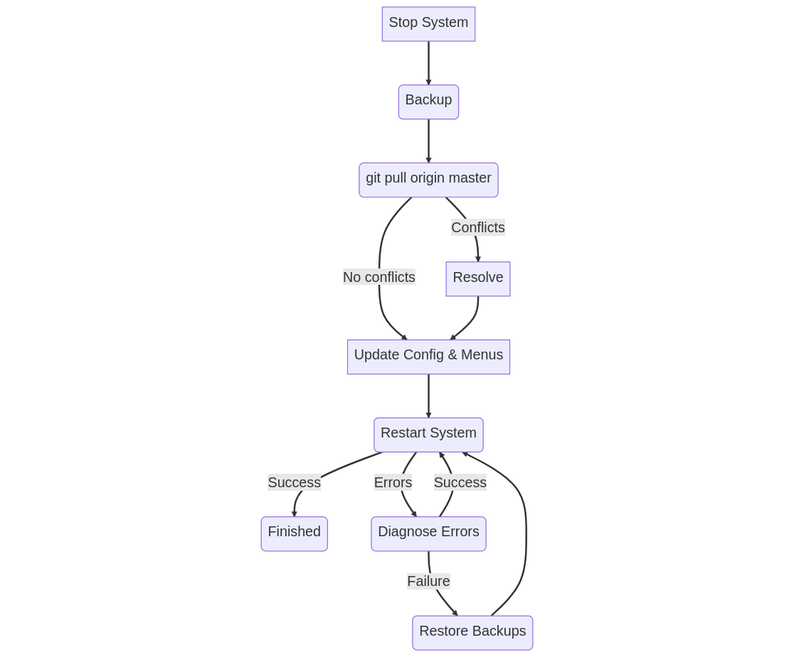

## Upgrading From Source
Keeping your system up to date ensures you have the latest fixes, features, and general improvements. Upgrading ENiGMA½ can be a bit of a learning curve compared to traditional binary-release systems you may be used to, especially when running from Git cloned source.

You will generally be pulling from `master`, so the process is as follows:
```bash
# stop system if running
cd enigma-bbs
# BACKUP YOUR SYSTEM
git pull origin master
# look for any errors
rm -rf node_modules # ONLY for Node.js upgrades!
npm install # or yarn, etc.
# 1. look for any errors
# 2. update any configuration or menus
#    (you can also do most of this live)
node main.js # restart system
```

Below is a visual representation of this process:



:::note
After upgrading, it is always recommended to look at [UPGRADE.md](https://github.com/NuSkooler/enigma-bbs/blob/master/UPGRADE.md) and inspect the version-to-version notes as well as the [WHATSNEW](https://github.com/NuSkooler/enigma-bbs/blob/master/WHATSNEW.md).
:::

### Configuration File Updates
After an upgrade, **it is possible that your system is missing new features exposed in the default theme/menu layout**. To check this, you can look at the template menu files in `misc/menu_templates`, and `config_template.in.hjson` as well as the default `luciano_blocktronics/theme.hjson` files for changes/additions.

#### 💡Tips
* Create a clean checkout of ENiGMA via `git clone https://github.com/NuSkooler/enigma-bbs.git enigma-bbs-clean` and run it to see any new features within the default configuration!
* As the template files described above are likely what you built your system from, a visual diff viewer such as [DiffMerge](https://www.sourcegear.com/diffmerge/downloads.php) (free, works on all major platforms) can be very helpful for the tasks outlined above!


:::tip
It is recommended to [monitor logs](../troubleshooting/monitoring-logs.md) and poke around a bit after an upgrade!
:::

## Something Went Wrong!
Check [TROUBLESHOOTING](https://github.com/NuSkooler/enigma-bbs/blob/master/TROUBLESHOOTING.md) first.