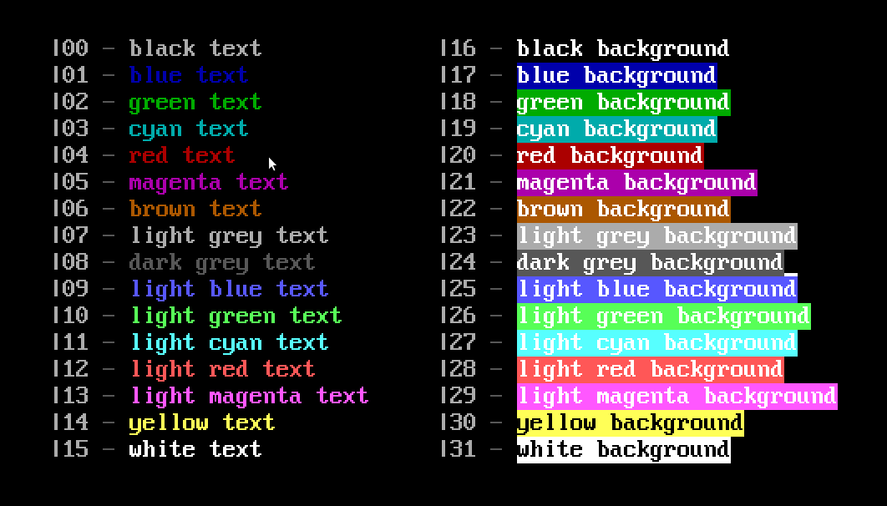

ENiGMA½ supports Renegade-style pipe colour codes for formatting strings. You'll see them used throughout your configuration, and can also be used in places like onelinerz, rumourz, full screen editor etc.

## Usage
When ENiGMA½ encounters colour codes in strings, they'll be processed in order and combined where possible.

For example:

`|15|17Example` - white text on a blue background

`|10|23Example` - light green text on a light grey background

## Colour Code Reference

:::caution
Colour codes |24 to |31 are considered "blinking" or "iCE" colour codes. On terminals that support them they'll
be shown as the correct colours - for terminals that don't, or are that are set to "blinking" mode - they'll blink!
:::

