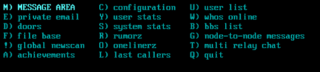

A full menu view displays items in a paginated grid of one or more columns. It is intended for longer lists that will not fit on a single screen. Items are selected with the cursor keys, Page Up, Page Down, Home and End, or by a `hotKey`.

:::note
A full menu view is defined with a percent (%) and the characters FM, followed by the view
number if used. For example: `%FM1`
:::

:::note
See [Views](views.md) for the **common view properties**, the **common menu view
properties**, and the shared **Hot Keys** and **Items** reference — all of which
apply here.
:::

## Properties

A full menu view arranges items into columns and pages. The number of items
per column is derived from `height` and `itemSpacing`; `itemHorizSpacing` sets
the gap between columns. When the items do not fit, the view paginates and the
cursor keys move between pages.

## Examples

### A simple vertical menu - similar to VM


<details>
<summary>Configuration fragment (expand to view)</summary>

```hjson
FM1: {
  submit: true
  argName: navSelect
  width: 1
  items: [
    {
      text: login
      data: login
    }
    {
      text: apply
      data: new user
    }
    {
      text: about
      data: about
    }
    {
      text: log off
      data: logoff
    }
  ]
}

```

</details>

### A simple horizontal menu - similar to HM


<details>
<summary>Configuration fragment (expand to view)</summary>

```hjson
FM2: {
  focus: true
  height: 1
  width: 60 // set as desired
  submit: true
  argName: navSelect
  items: [
    "prev", "next", "details", "toggle queue", "rate", "help", "quit"
  ]
}
```

</details>

### A multi-column navigation menu with hotkeys




<details>
<summary>Configuration fragment (expand to view)</summary>

```hjson
FM1: {
  focus: true
  height: 6
  width: 60
  submit: true
  argName: navSelect
  hotKeys: { M: 0, E: 1, D: 2 ,F: 3,!: 4, A: 5, C: 6, Y: 7, S: 8, R: 9, O: 10, L:11, U:12, W: 13, B:14, G:15, T: 16, Q:17  }
  hotKeySubmit: true
  items: [
    {
      text: M) message area
      data: message
    }
    {
      text: E) private email
      data: email
    }
    {
      text: D) doors
      data: doors
    }
    {
      text: F) file base
      data: files
    }
    {
      text: !) global newscan
      data: newscan
    }
    {
      text: A) achievements
      data: achievements
    }
    {
      text: C) configuration
      data: config
    }
    {
      text: Y) user stats
      data: userstats
    }
    {
      text: S) system stats
      data: systemstats
    }
    {
      text: R) rumorz
      data: rumorz
    }
    {
      text: O) onelinerz
      data: onelinerz
    }
    {
      text: L) last callers
      data: callers
    }
    {
      text: U) user list
      data: userlist
    }
    {
      text: W) whos online
      data: who
    }
    {
      text: B) bbs list
      data: bbslist
    }
    {
      text: G) node-to-node messages
      data: nodemessages
    }
    {
      text: T) multi relay chat
      data: mrc
    }
    {
      text: Q) quit
      data: quit
    }
  ]
}
```

</details>
