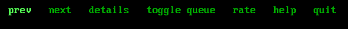

A horizontal menu view displays a list of items side by side in a single row, similar to a lightbar. Items are selected with the cursor keys, Page Up, Page Down, Home and End, or by a `hotKey`.

:::note
A horizontal menu view is defined with a percent (%) and the characters HM, followed by the view
number if used. For example: `%HM1`
:::

:::note
See [Views](views.md) for the **common view properties**, the **common menu view
properties**, and the shared **Hot Keys** and **Items** reference — all of which
apply here.
:::

## Properties

A horizontal menu lays its items out along one row, so `width` sets the
total width available to the whole list (default 15) and `itemSpacing`
separates items horizontally rather than vertically.

## Example



<details>
<summary>Configuration fragment (expand to view)</summary>

```hjson
HM2: {
  focus: true
  width: 60 // set as desired
  submit: true
  argName: navSelect
  items: [
    "prev", "next", "details", "toggle queue", "rate", "help", "quit"
  ]
}
```

</details>
