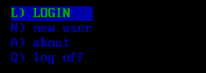

A vertical menu view displays a list of items down a single column, similar to a lightbar. It is the most common menu view in ENiGMA½. Items are selected with the cursor keys, Page Up, Page Down, Home and End, or by a `hotKey`.

:::note
A vertical menu view is defined with a percent (%) and the characters VM, followed by the view
number if used. For example: `%VM1`
:::

:::note
See [Views](views.md) for the **common view properties**, the **common menu view
properties**, and the shared **Hot Keys** and **Items** reference — all of which
apply here.
:::

## Properties

In addition to the common menu view properties, a vertical menu view accepts:

| Property | Description |
|----------|-------------|
| `focusItemAtTop` | If `true`, the focused item is kept at the top of the visible window as the user scrolls, rather than the list scrolling around it |

A vertical menu scrolls when it has more items than `height` rows, so `height`
determines how many items are visible at once.

## Example



<details>
<summary>Configuration fragment (expand to view)</summary>

```hjson
VM1: {
  submit: true
  argName: navSelect
  items: [
    {
      text: login
      data: login
    }
    {
      text: apply
      data: new user
    }
    {
      text: about
      data: about
    }
    {
      text: log off
      data: logoff
    }
  ]
}

```

</details>
