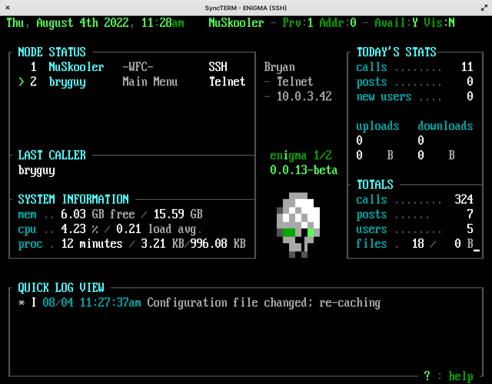

## The Waiting For Caller (WFC) Module
The `wfc.js` module provides a Waiting For Caller (WFC) type dashboard from a bygone era. Many traditional features are available including newer concepts for modern times. Node spy is left out as it feels like something that should be left in the past.

<br/>

## Accessing the WFC
By default, the WFC may be accessed via the `!WFC` main menu command when connected over a secure connection via a user with the proper [ACS](../configuration/acs.md). This can be configured as per any other menu in the system. Note that ENiGMA½ does not expose the WFC as a standalone application as this would be much less flexible. To connect locally, simply use your favorite terminal or for example: `ssh -l yourname localhost 8889`. See **Security** below for more information.

## Security
The system allows any user with the proper security to access the WFC / system operator functionality. The security policy is enforced by ACS with the default of `SCAF2ID1GM[wfc]`, meaning the following are true:

1. Securely Connected (such as SSH or Secure WebSocket, but not Telnet)
2. [Auth Factor 2+](user-2fa-otp-config.md). That is, the user has 2FA enabled.
3. User ID of 1 (root/admin)
4. The user belongs to the `wfc` group.

:::note
Due to the above, the WFC screen is **disabled** by default as at a minimum, you'll need to add your user to the `wfc` group. See also [Security](../configuration/security.md) for more information on keeping your system secure!
:::

Adding your user to the `wfc` group:
```bash
# Replace USERNAME with your leet +op username
./oputil.js user group USERNAME "+wfc"
```

To change the ACS required, specify an alternative `acs` in the `config` block. For example:
```hjson
mainMenuWaitingForCaller: {
    config: {
        // initial +op over secure connection only
        acs: ID1SC
    }
}
```

:::tip
You can add additional co-ops by adjusting the required ACS and/or adding them to a WFC-able group.
:::

:::caution
ENiGMA½ will enforce ACS of at least `SC` (secure connection)
:::

## Configuration
### Config Block
The WFC `config` block allows for the following keys:

| Key | Required | Description |
|-----|----------|-------------|
| `acs` | Yes | See [Security](#security) above. |
| `opVisibility` | No | Boolean. Set to `true` or `false` to change visibility when entering the WFC. |
| `quickLogLevel` | No | Sets the log level for the quick log view. Defaults to `info`. See also [Monitoring Logs](../troubleshooting/monitoring-logs.md). |
| `art` | Yes | An object containing art specs: `main` for the WFC main view and `help` for a help screen. |
| `confirmKickNodePrompt` | No | Override the prompt name used for the "Kick selected node?" prompt. Defaults to `confirmKickNodePrompt`. |
| `pageIndicator` | No | String shown in the node list for nodes with a pending sysop chat page. Defaults to `!`. |
| `chatMenuName` | No | Override the menu name used for sysop chat. Defaults to `sysopChat`. |
| `nodeMessageMenuName` | No | Menu used when sending a node message from the WFC. Defaults to `nodeMessage`. |
| `notifications` | No | Where each kind of notification goes while you are at the WFC. See [Notifications](#notifications) below. |
| `inboxMaxItems` | No | How many messages the inbox holds before evicting. Read items are evicted before unread. Defaults to `50`. |
| `messageAlert` | No | Boolean. Send a BEL when a message arrives. Defaults to `true`. |
| `messagePreviewLength` | No | Max length of `{pendingNodeMessagePreview}`. Defaults to `40`. |
| `messageListFormat` | No | Format for each row of the message list. Tokens below. |
| `messageDetailFormat` | No | Format for the detail pane. Defaults to `{text}`. |
| `noMessagesText` | No | Shown when the inbox is empty. |
| `statusBarMessagesFormat` | No | `%SB5` messages panel. Token: `{count}`. Defaults to `MSG {count}`. |
| `statusBarPagesFormat` | No | `%SB5` pages panel. Token: `{count}`. Defaults to `PAGE {count}`. |
| `hideCursor` | No | Boolean. Hide the terminal cursor while on the dashboard, which otherwise parks wherever the last refresh finished drawing. Defaults to `true`. |


## Notifications
An +op sitting at the WFC is a node like any other, so achievements, node messages and time warnings are all aimed at their terminal. Painting any of those over the dashboard would corrupt it, so each kind is **routed** instead of displayed.

Routing is per notification type, and each type names zero or more *sinks*:

| Sink | Effect |
|------|--------|
| `inbox` | Held for you to read with the message key. Sends a BEL unless `messageAlert` is `false`. |
| `statusBar` | Surfaces as a count in a `%SB5` panel. |
| `log` | Rely on the log and surface nothing further here. Achievements are logged by the achievement subsystem for every op, not only one sitting at the WFC, so this sink means "it is already in the quick log and full log viewers". |
| `ticker` | Fed to a `%TK` ticker. |
| `interrupt` | Fall through to normal behaviour — displayed full screen with a pause. |

Defaults:

| Type | Default sinks | Why |
|------|---------------|-----|
| `nodeMsg` | `inbox`, `statusBar` | Read them when you choose to. |
| `achievement` | `log` | Decorative; the log already shows it. |
| `achievementGlobal` | `log` | As above — a busy board earns a lot of these. |
| `sysopPage` | *(none)* | Already surfaced via `{pendingPage*}` and the node list indicator. |
| `timeWarning` | *(none)* | Sysops are typically unlimited. |
| `system` | `interrupt` | Anything untagged behaves exactly as before. |

Override in the WFC `config` block:

```hjson
notifications: {
    nodeMsg: {
        sinks: [
            inbox
            statusBar
        ]
    }
    achievementGlobal: {
        sinks: [
            ticker
        ]
    }
}
```

:::caution
HJSON will not accept bare words sharing a line inside `[ ]` — `sinks: [ inbox, statusBar ]` fails to parse. Keep one per line, or quote each element.
:::

## Node Messages
With the default key bindings:

| Key | Action |
|-----|--------|
| `M` | Open the message viewer |
| `S` | Send a node message to the node selected in `VM1`. Selecting your own node sends to `-ALL-`. |

Inside the viewer: `R` replies to the sender, `D` or `DEL` dismisses, `ESC`/`Q` returns to the dashboard.

The viewer uses the `messages` art spec with `%VM1` (list) and `%MT2` (detail). **If that art is missing, a plain text list is shown instead**, so the feature works before a theme provides art.

Message list and detail format tokens: `{index}`, `{id}`, `{userName}`, `{realName}`, `{nodeId}`, `{type}`, `{read}`, `{timestamp}`, `{text}`.

## Theming
The following MCI codes are available:
* `VM1`: Node status list with the following format items available:
    * `text`: Username or `*Pre Auth*`.
    * `action`: Current action/menu.
    * `affils`: Any affiliations for the authenticated user, else "N/A".
    * `authenticated`: Boolean whether the node is authenticated (logged in) or not.
    * `availIndicator`: Availability indicator. Displayed via `statusAvailableIndicators` or system theme. See also [Themes](../art/themes.md).
    * `isAvailable`: Boolean whether the node is available (e.g. for messaging) or not.
    * `isSecure`: Is the node securely connected (e.g. SSL/SSH)?
    * `isVisible`: Boolean whether the node is visible to others or not.
    * `node`: The node ID.
    * `pageIndicator`: Non-empty when the node has a pending sysop chat page. Defaults to `!`. Override with `pageIndicator` in the WFC `config` block.
    * `realName`: Real name of authenticated user, or "N/A".
    * `remoteAddress`: A friendly formatted remote address such as an IPv4 or IPv6 address.
    * `serverName`: Name of connected server such as "Telnet" or "SSH".
    * `timeOn`: How long the node has been connected.
    * `timeOnMinutes`: How long in **minutes** the node has been connected.
    * `userId`: User ID of authenticated node, or 0 if not yet authenticated.
    * `userName`: User name of authenticated user or `*Pre Auth*`.
    * `visIndicator`: Visibility indicator. Displayed via `statusVisibleIndicators` or system theme. See also [Themes](../art/themes.md).
* `VM2`: Quick log with the following format keys available:
    * `timestamp`: Log entry timestamp in `quickLogTimestampFormat` format.
    * `level`: Log entry level from Bunyan.
    * `levelIndicator`: Level indicators can be overridden with the `quickLogLevelIndicators` key (see defaults below).
    * `quickLogLevelIndicators`: A **map** defaulting to the following:
        * `trace`: `T`
        * `debug`: `D`
        * `info`: `I`
        * `warn`: `W`
        * `error`: `E`
        * `fatal`: `F`
    * `nodeId`: Node ID.
    * `sessionId`: Session ID.
    * `quickLogLevelMessagePrefixes`: A **map** of log level names (see above) to message prefixes. Commonly used for changing message color with pipe codes, such as `|04` for red errors.
    * `message`: Log message.
* `MT3` or `ET3`: Selected node status information. May be a single or multi-line view.
    * Set `nodeStatusSelectionFormat` to the format desired, using `\n` for line feeds in an `MT` view. The available format keys are the same as the node status list above.
* `SB5`: Optional status bar. Named panels `messages` and `pages` are driven from code; format them with `statusBarMessagesFormat` / `statusBarPagesFormat`. See [Status Bar View](../art/views/status_bar_view.md).
* MCI 10...99: Custom entries with the following format keys available:
    * `nowDate`: Current date in the `dateFormat` style, defaulting to `short`.
    * `nowTime`: Current time in the `timeFormat` style, defaulting to `short`.
    * `now`: Current date and/or time in `nowDateTimeFormat` format.
    * `processUptimeSeconds`: Process (the BBS) uptime in seconds.
    * `totalCalls`: Total calls to the system.
    * `totalPosts`: Total posts to the system.
    * `totalUsers`: Total users on the system.
    * `totalFiles`: Total number of files on the system.
    * `totalFileBytes`: Total size in bytes of the file base.
    * `callsToday`: Number of calls today.
    * `postsToday`: Number of posts today.
    * `uploadsToday`: Number of uploads today.
    * `uploadBytesToday`: Total size in bytes of uploads today.
    * `downloadsToday`: Number of downloads today.
    * `downloadBytesToday`: Total size in bytes of downloads today.
    * `newUsersToday`: Number of new users today.
    * `currentUserName`: Current user name.
    * `currentUserRealName`: Current user's real name.
    * `lastLoginUserName`: Last login username.
    * `lastLoginRealName`: Last login user's real name.
    * `lastLoginDate`: Last login date in `dateFormat` format.
    * `lastLoginTime`: Last login time in `timeFormat` format.
    * `lastLogin`: Last login date/time.
    * `totalMemoryBytes`: Total system memory in bytes.
    * `freeMemoryBytes`: Free system memory in bytes.
    * `systemAvgLoad`: System average load.
    * `systemCurrentLoad`: System current load.
    * `newPrivateMail`: Number of new **private** mail for current user.
    * `newMessagesAddrTo`: Number of new messages **addressed to the current user**.
    * `availIndicator`: Is the current user available? Displayed via `statusAvailableIndicators` or system theme. See also [Themes](../art/themes.md).
    * `visIndicator`: Is the current user visible? Displayed via `statusVisibleIndicators` or system theme. See also [Themes](../art/themes.md).
    * `processBytesIngress`: Ingress bytes since ENiGMA started.
    * `processBytesEgress`: Egress bytes since ENiGMA started.
    * `pendingPageCount`: Number of pending sysop chat pages across all nodes.
    * `pendingPageUser`: Username of the most recent pending page, or empty.
    * `pendingPageNode`: Node ID of the most recent pending page, or empty.
    * `pendingPageMessage`: Message/reason of the most recent pending page, or empty.
    * `pendingNodeMessageCount`: Number of **unread** messages in the inbox.
    * `pendingNodeMessageTotal`: Total messages in the inbox, read or not.
    * `pendingNodeMessageUser`: Username who sent the most recent unread message, or empty.
    * `pendingNodeMessageNode`: Node ID of that sender, or empty.
    * `pendingNodeMessagePreview`: Truncated text of that message. Length via `messagePreviewLength`.


:::note
While [Standard MCI](../art/mci.md) codes work on any menu, they will **not** refresh. For values that may change over time, please use the custom format values above.
:::

## Sysop Chat / Break Into Chat
The WFC supports receiving pages from users and initiating chat with any connected node.

### Receiving a Page
When a user pages the sysop:
1. An alert is sent according to `sysopChat.pageAlert` in `config.hjson` — `bel` (default, sends `\x07` to sysop terminals), `none` (silent), or `command` (runs a shell command).
2. Sysops **not** at the WFC receive an interrupt notification with the user's name, node, and message.
3. Sysops **at** the WFC see the page reflected immediately via `pendingPageCount`, `pendingPageUser`, `pendingPageNode`, and `pendingPageMessage` custom tokens, plus a `pageIndicator` on the paging node's row in `VM1`. No duplicate interrupt is queued for them.

### Breaking Into Chat
With a node selected in `VM1`, press `B` to break into chat. If the selected node has a pending page, that session is accepted; otherwise a new sysop-initiated session is created. Both parties enter the `sysopChat` menu directly — no pre-chat confirmation is shown to the user.

### System Config (`sysopChat` block in `config.hjson`)

| Key | Default | Description |
|-----|---------|-------------|
| `pageCooldownMinutes` | `5` | Minimum minutes a user must wait between pages. |
| `pageAlert` | `bel` | Alert mode on page arrival: `bel` (sends `\x07` to sysop terminals), `none` (silent), or `command` (runs `pageAlertCommand`). |
| `pageAlertCommand` | `''` | Shell command run when `pageAlert` is `command`. Tokens: `{userName}`, `{nodeId}`, `{message}`. Example: `'notify-send "Page from {userName}" "{message}"'` |
